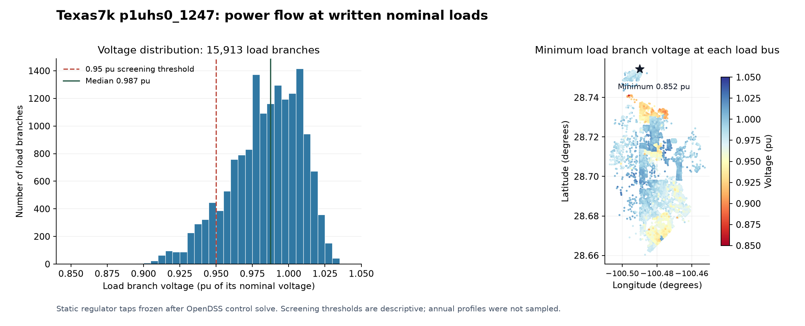

# Texas7k substation p1uhs0_1247 conversion pilot

A BMOPF JSON 0.2.0 **proposal-schema** PF snapshot, generated with PowerIO and
an OpenDSS-assisted adapter, then independently solved by Tellegen. Original
files, source hashes and source/license evidence are kept alongside it.

The input has six feeders, 19,598 electrical buses, 38,218 voltage nodes,
15,299 loads and 2,774 physical transformers. The output has 22,081 buses:
all original electrical buses, 2,482 internal leakage-star buses and one
internal source bus. There are 16,822 lines, 282 delta/wye transformers,
7,474 single-phase transformer legs and one source. Coordinates cover all
22,081 buses through direct `bus[id].longitude` and `bus[id].latitude`
fields, matching the Springfield and French cases. The same coordinates remain
in `extras.geojson`; internal locations are marked there as derived. Its
`powerio_geo.space` is explicitly `geographic`, so Tellegen uses geographic
map placement rather than treating the values as planar drawing coordinates.

## Why use an adapter around PowerIO?

1. The supplied master requests 35,040 annual steps and references external
   profiles. This pilot instead uses the written nominal kW/kvar and solves
   static controls. All 12 regulator taps are frozen at that solution.
2. The 2,482 split-phase transformers have unequal pairwise reactances.
   BMOPF's symmetric `center_tap` fields cannot retain them. Three two-winding
   single-phase transformers sharing an internal star point preserve all
   three leakage arms, polarity, winding resistance and no-load losses.
3. OpenDSS closed switches have finite dummy impedances; PowerIO's switch
   model is ideal, and Tellegen's fixed snapshot rejects closed ideal switches.
   The adapter uses the actual effective line R/X/C matrices and lengths.
   Twenty disabled switch branches are excluded, retaining their source data.
4. PowerIO emits the normal BMOPF structure. The adapter then rescales winding
   impedances when a secondary tap is moved into BMOPF's single primary tap
   ratio. With original taps t1,t2, BMOPF uses t1/t2; all series impedances
   are multiplied by t2². The tested uncorrected output differed by about
   5.23% in complex bus voltage; the corrected result is shown below.
5. Effective continuous NormAmps ratings override default emergency ratings
   for `i_max`. Coordinates and source/derivative provenance are retained.

This is a bounded adapter for this substation, not a general converter for
all Texas files. PowerIO and Tellegen repositories were not modified.

## Validation

See `validation_report.json` and the compressed reference/parameter archives.
The electrical projection passes the pinned BMOPF 0.2.0 proposal schema
(SHA-256 recorded in the JSON). As for the French cases, direct bus
`longitude`/`latitude` are coordinate extensions to the strict schema. Every
pair is checked against its geographic Point and checked for finite values
and degree ranges; only these two bus fields are removed for schema validation. Tellegen converges in 23 iterations with one sparse factorization
and a 40,700-dimensional matrix. The maximum physical KCL residual is about
4.79e-6 A; tolerances are recorded in `tellegen_options.json`.

| Comparison across all 38,218 original nodes | Maximum complex-voltage error |
|---|---:|
| Original OpenDSS equipment, controls frozen | 2.2371e-6 pu |
| Same OpenDSS case with only numerical `ppm_antifloat` shunts set to zero | 1.3553e-8 pu |

The per-unit error divides each complex voltage difference by the largest
reference phase-voltage magnitude at that bus. Source import differs by
about 7 W and 573 var; the latter largely reflects the numerical shunts.
Minimum/maximum reported phase voltage are about 0.852/1.041 pu. This pilot
adds no operational voltage bounds and is not an OPF instance.

## Reproduce

Use Python 3.12 with the pinned `scripts/Texas7k/requirements.txt`, a PowerIO
CLI built from commit `597fa930990d7b9d7278a0f7857ef1406859fc1c`, its vendored
0.2.0 schema, and Tellegen's `mc_pf` example (`--features mc-pf`). The local
Tellegen checkout was `6f0be90f561ad4b67d35848c4c70f98a3154e004`; executable
hashes are in `software_provenance.json`. The pilot used PowerIO 0.11.2.
The Tellegen revision is the validation checkout, not a verified build revision
of the cached native executable; its actual SHA-256 is recorded. A fresh build
may produce slightly different rounding within the stated comparison tolerances.

From the BMOPFDraftData root, with executable locations supplied:

```sh
python scripts/Texas7k/convert_substation.py \
  --source test/data/Texas7k/p1uhs0_1247 \
  --workdir /tmp/texas7k-new-run \
  --powerio /path/to/powerio \
  --schema /path/to/powerio/powerio-dist/schemas/bmopf/0.2.0/bmopf.schema.json \
  --tellegen /path/to/tellegen/mc_pf
```

The workdir must be fresh. Output includes the BMOPF JSON, schema/physics
report, reference voltages, transformer mappings and diagnostics. Re-running
this workflow from a fresh directory reproduced the reported result. Full
annual profile data is intentionally unnecessary for this nominal snapshot.

To re-fetch the vetted source files, run `scripts/Texas7k/download_substation.py`
with `--manifest test/data/Texas7k/source_manifest.json` and a destination
named `p1uhs0_1247`. Every file is checked against the pinned source hashes.

The source and derivative data follow the OEDI registry's CC BY 3.0 US license;
see `License.md` and `SOURCE_NOTICE.md`. The scripts are MIT licensed. This is
a PF pilot, outside the curated OPF benchmark index.

## Power-flow overview

The nominal snapshot imports 102.829 MW and 46.279 MVAr, supplying 96.376 MW
of load with 6.453 MW of real losses. Load branch voltages range from 0.852 to
1.041 pu; 1,665 of 15,913 load branches are below the descriptive 0.95 pu
threshold. There are 407 line branches above their continuous rating, and the
40 MVA supply transformer carries 48.357 MVA. Convergence establishes a PF
solution, not compliance with equipment limits or OPF feasibility.



`power_flow_summary.json` records the quantities, rating conventions and an
independent OpenDSS loading check. The reproduction pipeline regenerates the
summary and both figure formats before discarding the large native port dump.
`opendss_reference.json.gz`, `engine_parameters.json.gz` and
`tellegen_voltages.json.gz` retain comparison inputs in compressed form.
See [the workflow README](../../scripts/Texas7k/README.md) for dependency setup,
source verification, and the separate Tellegen browser-import check.

`artifact_manifest.json` pins SHA-256 hashes and sizes of the distributed pilot artifacts.
